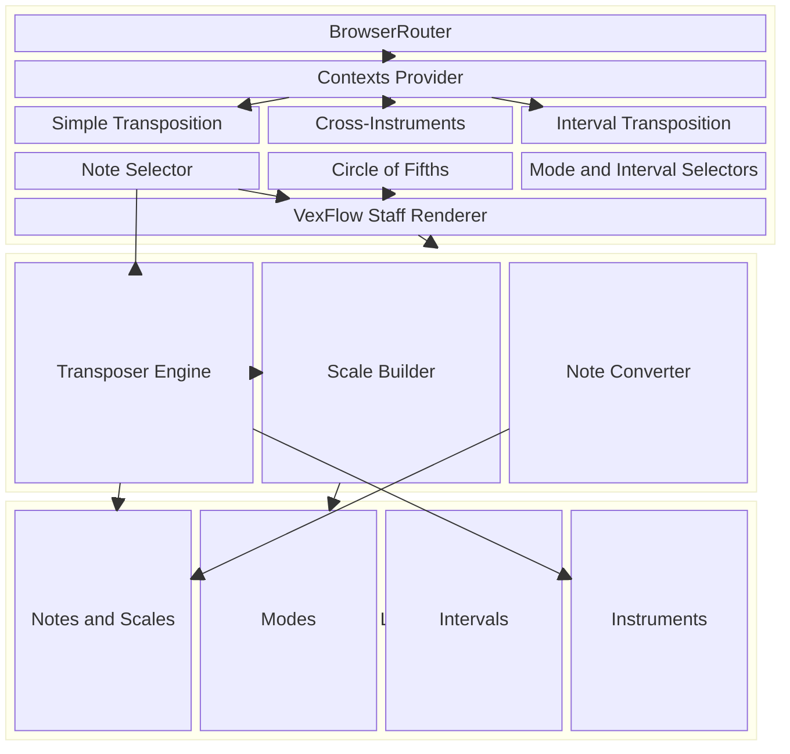

## Context / Problem

Musicians regularly need to transpose notes and scales between instruments pitched in different keys (e.g. Bb clarinet to Eb alto saxophone). This requires mental arithmetic over the circle of fifths, accounting for enharmonic equivalents, key signatures, and modal contexts. Existing tools are either oversimplified (single-note lookup tables) or buried inside full notation software that's overkill for quick transposition tasks.

## Solution

ClaveShift is a React/TypeScript single-page application that handles three transposition modes with real-time staff notation rendering:

- **Cross-instrument transposition** — select origin and target instrument keys, pick a note or full scale, and get the correctly enharmonic-spelled result with key signature
- **Interval-based transposition** — transpose by any of 13 intervals (unison through octave) in either direction, with proper accidental selection based on circle of fifths position
- **Scale and mode support** — generates all 7 diatonic modes (Ionian through Locrian) with correct key signatures and accidentals
- **Interactive circle of fifths** — SVG visualization that rotates to reflect mode offsets and highlights the active key
- **VexFlow staff rendering** — professional SVG music notation with clefs, key signatures, accidentals, and color-coded note annotations
- **Multilingual interface** — English, French, Spanish, and German with browser language auto-detection and three notation systems (English, Romance, German)
- **Shareable URLs** — transposition state encoded in route params so results can be bookmarked and shared

## Architecture

## Current State

The core transposition engine and all three transposition modes are fully functional. The application currently supports four languages and three notation systems with URL-driven state for shareable results. Active work is on the `vexflow-integration` branch, migrating from a custom staff renderer to VexFlow for professional-quality music notation with proper key signatures, accidentals, and clef rendering. Next steps include completing the VexFlow integration and deploying the updated notation rendering.
